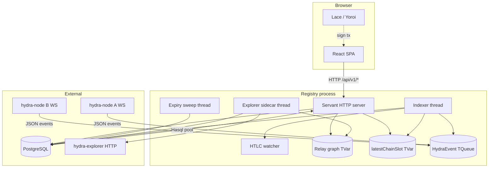
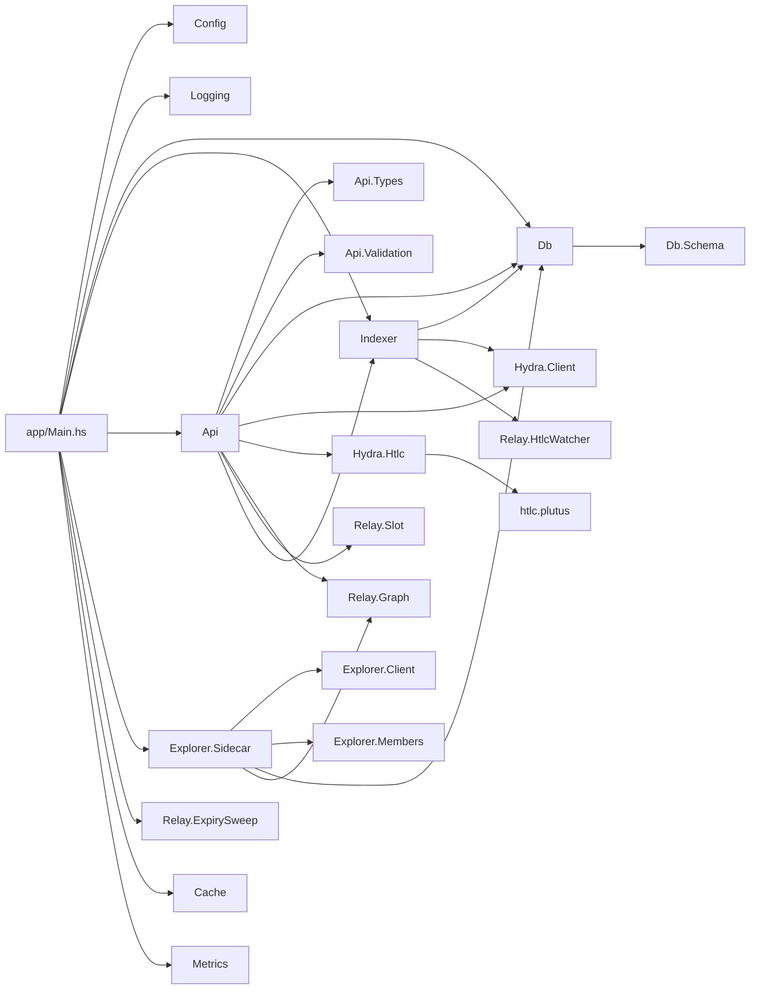
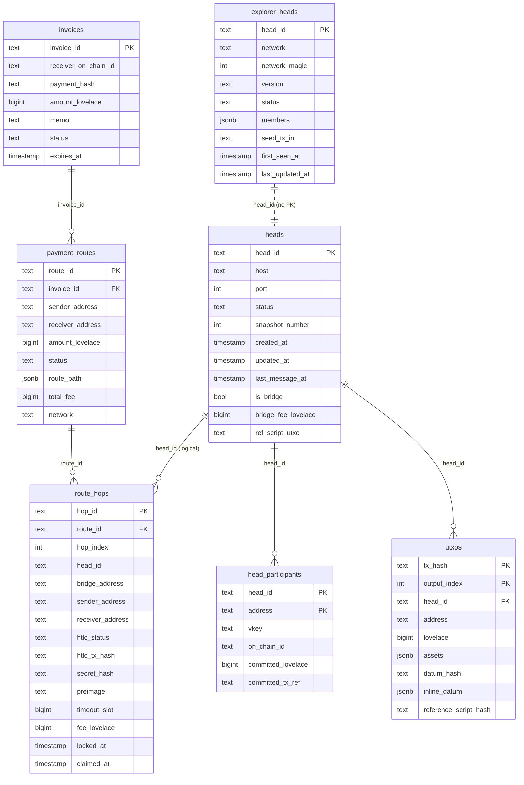
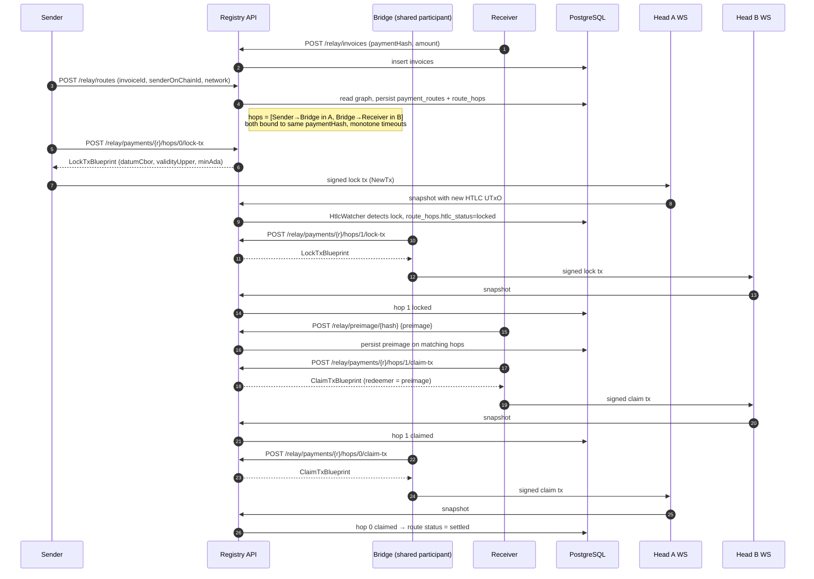
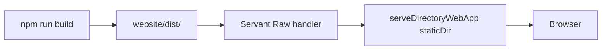
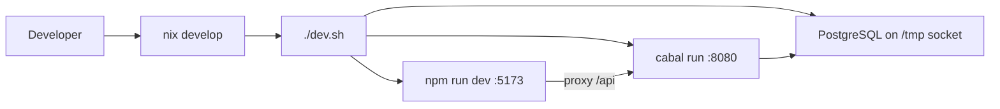

# Hydra Registry — Architecture

> This document is the source of truth for how the Hydra Registry payment-relay system is put together. Update it whenever significant structure, modules, tables, threads, or routes change. Smaller fixes do not need an entry here; cross-cutting refactors do.

---

## 1. What this system is

The Hydra Registry is a **cross-Hydra-head payment relay** for Cardano. It indexes L2 UTxO state from a set of registered Hydra nodes, exposes that state through a Blockfrost-compatible HTTP API for wallets, and — the headline feature — routes payments across multiple heads via an HTLC (Hash Time-Locked Contract) cascade so funds locked into one head can be claimed in another without ever leaving L2.

The hops are stitched together by **shared participants**: if Alice runs a node in head A and Bob runs a node in head B, and both share a third participant (Ida, the bridge), then a payment from Alice to Bob locks an HTLC in A redeemable by Ida, and Ida re-locks an equivalent HTLC in B redeemable by Bob, both pinned to the same payment hash. Bob reveals the preimage to claim in B, Ida sees the preimage on chain (technically: in the L2 snapshot) and uses it to claim in A.

There are three deployable artifacts:

| Artifact | Path | Purpose |
| --- | --- | --- |
| `hydra-registry-api` | `api/` | Haskell Servant HTTP API + indexer + relay graph + HTLC watcher |
| Website | `website/` | React/Vite single-page UI, served by the API binary as static files |
| Tools | `tools/` | Browser-side HTLC wallet helper for manual lock/claim |

Plus a `testnet/` harness for running cardano-node + multiple hydra-nodes locally.

---

## 2. High-level topology



The box labelled *Registry process* is one binary, one OS process. All threads share the same Hasql connection pool, the same `HydraEvent` queue, and the same set of TVars described in §4.4.

---

## 3. Repository layout

```
hydra.registry/
├── api/                       # Haskell Servant backend
│   ├── app/Main.hs            # process entry point + thread spawn
│   ├── src/
│   │   ├── Api.hs             # Servant route table + handlers
│   │   ├── Api/Types.hs       # request/response records
│   │   ├── Api/Validation.hs  # Cardano address shape checks
│   │   ├── Cache.hs           # generic TTL cache (TVar Map)
│   │   ├── Config.hs          # env-var loading
│   │   ├── Db.hs              # session runner + CRUD
│   │   ├── Db/Schema.hs       # Rel8 table definitions
│   │   ├── Explorer/
│   │   │   ├── Client.hs      # JSON parser for hydra-explorer
│   │   │   ├── Members.hs     # member-list → participant tuples
│   │   │   └── Sidecar.hs     # poll loop + graph rebuild
│   │   ├── Hydra/
│   │   │   ├── Client.hs      # WS listener + HydraEvent ADT
│   │   │   └── Htlc.hs        # CBOR encoding for datum/redeemer
│   │   ├── Indexer.hs         # event loop + reconnectAllHeads
│   │   ├── Logging.hs         # structured JSON logging
│   │   ├── Metrics.hs         # Prometheus counters
│   │   ├── Middleware/RateLimit.hs
│   │   └── Relay/
│   │       ├── ExpirySweep.hs # invoice/route expiry
│   │       ├── Graph.hs       # Dijkstra + route → HTLC expansion
│   │       ├── HtlcWatcher.hs # detect lock/claim from snapshots
│   │       └── Slot.hs        # slot ↔ POSIX-ms per network
│   └── test/                  # hspec test suite
├── website/                   # React/Vite SPA
│   ├── src/
│   │   ├── api/client.ts      # typed wrapper over fetch
│   │   ├── components/
│   │   ├── context/NetworkContext.tsx
│   │   └── pages/
│   ├── public/
│   └── dist/                  # build output, served by the API
├── tools/                     # browser HTLC wallet helper (Vite)
├── testnet/                   # cardano-node + hydra-node harness
│   ├── run.sh                 # start cardano-node (Mithril snapshot)
│   ├── hydra.sh               # launch 4 hydra-nodes / 2 heads
│   ├── open-heads.sh
│   ├── data/                  # per-network state, keys, logs
│   └── scripts/               # always-fails.plutus etc
├── .github/workflows/ci.yml   # backend tests + frontend build
├── htlc.plutus                # PlutusScriptV3 HTLC validator (CBOR)
├── flake.nix                  # GHC, cabal, node, postgres dev shell
├── dev.sh                     # one-shot dev launcher
├── README.md / RUN.md
└── ARCHITECTURE.md            # this file
```

---

## 4. Backend (`api/`)

### 4.1 Stack

- **Language:** Haskell, GHC 9.10
- **Web:** Servant (`API` type at `Api.hs:80`)
- **DB:** Rel8 over Hasql, PostgreSQL 16
- **Concurrency:** `async` + STM (`TVar`, `TQueue`)
- **WebSockets:** `Network.WebSockets` for hydra-node connections
- **Logging:** Aeson-encoded JSON to stdout
- **Build:** Cabal, no Stack

### 4.2 Module map



### 4.3 Startup sequence

The order is deliberate; each step depends on the state set up by the previous one. Reference: `api/app/Main.hs`.

1. **Load config** — `HYDRA_DB_CONN_STR`, ports, `HYDRA_HTLC_SCRIPT_HASH`, `HYDRA_HTLC_SCRIPT_CBOR`, explorer URL/poll interval, static dir.
2. **Open Hasql pool**, run `Db.initDb` (idempotent `CREATE TABLE IF NOT EXISTS` + `ALTER TABLE … ADD COLUMN IF NOT EXISTS`). Schema migrations live entirely in `Db.initDb`.
3. **Allocate shared state:**
   - `eventQueue :: TQueue HydraEvent`
   - `chainSlotVar :: TVar Int64` (initial `0`)
   - `relayGraphVar :: TVar Graph.RelayGraph`
   - rate-limit map, address cache, metrics handles
4. **Spawn indexer thread** (`Indexer.startIndexer`). Reads `eventQueue` forever; on each event updates DB rows for the head, runs `HtlcWatcher.processUtxoSnapshot` if the HTLC script hash is configured, and bumps `chainSlotVar` from any `currentSlot` carried in a Greetings event.
5. **Reconnect to all registered heads** (`Indexer.reconnectAllHeads`). For each row in `heads`, open a WebSocket to `host:port` and push parsed events into `eventQueue`.
6. **Spawn explorer sidecar** (`Explorer.Sidecar.runSidecar`). Polls `hydra-explorer` every N seconds, syncs `explorer_heads` and `head_participants`, then atomically rebuilds the relay graph into `relayGraphVar`. The graph rebuild is independent of the explorer poll — sidecar swallows poll failures so the graph stays current even when explorer is unreachable.
7. **Spawn expiry sweep** (`Relay.ExpirySweep.runSweep`, every 60 s).
8. **Spawn rate-limit cleanup** (every 60 s).
9. **Build `AppEnv`** bundling all the above.
10. **Start Warp** with middleware stack `requestLogger → CORS → rateLimit → metrics`. Graceful shutdown cancels every `async` on `SIGTERM` / `SIGINT`.

### 4.4 Shared state

| State | Type | Producers | Consumers |
| --- | --- | --- | --- |
| `eventQueue` | `TQueue HydraEvent` | per-head WebSocket listeners | indexer |
| `chainSlotVar` | `TVar Int64` (monotonic) | indexer (via `bumpChainSlot`) | `handleFindRoutes`, `handleLockTx`, `handleClaimTx` (validity bounds, timeout derivation) |
| `relayGraphVar` | `TVar Graph.RelayGraph` | sidecar | `handleFindRoutes`, `handleRelayGraph` |
| `pool` | `Hasql.Pool` | n/a | every handler + every background thread |
| `addressCache` | `Cache [UtxoResponse]` | `handleAddressUtxos` (write-through) | same handler |
| `metrics` | `Metrics` (IORef counters) | middleware | `handleMetrics` |

Deliberate constraint: **no handler writes to `chainSlotVar` or `eventQueue`**. Only the indexer / WS listeners do. Handlers read.

### 4.5 Database schema



Schema and column declarations live in `api/src/Db/Schema.hs`; CRUD in `api/src/Db.hs`. `explorer_heads` deliberately has **no FK** to `heads` — the explorer indexes every Hydra head on chain, regardless of whether anyone has registered it with us.

### 4.6 API surface

Servant type in `api/src/Api.hs:80`. Routes group thematically:

| Group | Sample routes | Notes |
| --- | --- | --- |
| Health & metadata | `GET /`, `GET /api/v1/health`, `GET /api/v1/stats`, `GET /api/v1/metrics` | metrics is Prometheus text format |
| Head management | `POST /api/v1/heads/register`, `GET /api/v1/heads/check`, `GET/DELETE /api/v1/heads/{id}`, `POST /api/v1/heads/{id}/ref-script` | `ref-script` registers the head's published HTLC reference UTxO |
| L2 UTxO querying | `GET /api/v1/heads/{id}/addresses/{addr}/{balance,utxos}`, `GET /addresses/{addr}/utxos`, `POST /api/txs/utxoForAddresses` | last two are Blockfrost / Yoroi compat for wallets |
| Explorer | `GET /api/v1/explorer/heads`, `…/participants`, `GET /api/v1/explorer/stats`, `GET /api/v1/addresses/{addr}/heads` | reads `explorer_heads` + `head_participants` |
| Relay graph & invoices | `GET /api/v1/relay/graph`, `POST /api/v1/relay/invoices`, `GET …/{id}` | graph response includes nodes + edges for the UI viz |
| Routing & payments | `POST /api/v1/relay/routes`, `POST …/{id}/execute`, `GET /api/v1/relay/payments/{id}`, `POST /api/v1/relay/preimage/{hash}` | preimage broadcast unblocks bridge claims |
| HTLC blueprints | `GET /api/v1/htlc/validator`, `POST /api/v1/relay/payments/{routeId}/hops/{i}/{lock,claim,refund}-tx` | returns CBOR + slot bounds; **caller signs and submits** |
| Static files | catch-all `Raw` | serves `website/dist/` |

### 4.7 HTLC payment cascade

This is the central flow. Reference handlers in `Api.hs`; on-chain validator in `htlc.plutus`.



Important properties:

- **Atomicity**: receiver claims first; revealing the preimage on chain (in the head snapshot) is what lets every upstream bridge claim. If receiver never claims, every locked hop refunds at timeout.
- **Timeouts are monotone-decreasing downstream**: `routeToResponse` anchors the *receiver-side* hop at `chainSlot + secondsRemaining` and steps every upstream hop later by `hopTimeoutMarginSlots` (600 slots ≈ 10 min) via the `hopTimeoutSlot` helper in `Api.hs`. That gives a bridge time to claim its upstream lock after seeing the preimage land downstream, without losing the cascade's safety property.
- **`datum.timeout` is POSIX-ms, not slot**. The Plutus validator compares against `tx.validity_range`, which Plutus exposes as `POSIXTime ms`. `Relay.Slot.slotToPosixMs` does the conversion.
- **Validity upper bounds are clamped to `min(timeoutSlot - safety, chainTip + ERA_SAFE_WINDOW)`** to avoid `TimeTranslationPastHorizon` from the head ledger. See `clampValidityUpper` in `Api.hs`.
- **Min-ada on lock outputs** is dynamic: 7 ADA when the validator is inlined as the output's reference script, ~2 ADA when the head has published a shared reference UTxO via `POST /heads/{id}/ref-script`. The constants live in `Api.hs` (`htlcLockMinAdaInlineLovelace`, `htlcLockMinAdaSharedLovelace`).
- **Blueprints surface fee + collateral guidance**. Lock blueprints carry `recommendedFeeLovelace`; claim/refund blueprints additionally carry `collateralRequiredLovelace` so the caller can size `--tx-in-collateral` + `--tx-out-return-collateral` + `--tx-total-collateral` without learning that the head ledger demands `ceil(fee × collateralPercentage / 100)` from a `TxInvalid` error.

### 4.8 Detection: `Relay.HtlcWatcher`

The watcher is invoked from `Indexer.processEvent` on every Greetings/SnapshotConfirmed event. It diffs the new UTxO set against the previous one and:

- A **new** UTxO at the HTLC script address whose datum's `payment_hash` matches a `route_hops.secret_hash` → mark that hop `locked`, record `htlc_tx_hash`. Address comparison is **bech32-equality against the script address derived from the configured script hash for every supported network** (`htlcScriptAddresses`), not a substring match against hex — bech32 is base32 so the hex hash never appears literally.
- A **disappeared** HTLC UTxO whose tx ref matches a previously-locked hop → mark `claimed`. The watcher doesn't try to extract the preimage from the redeemer; the API receives it via `POST /relay/preimage/{hash}` and propagates.

`Hydra.Client.parseHydraMessage` for `SnapshotConfirmed` merges `snapshot.utxo` ∪ `snapshot.utxoToCommit` so the indexer sees an incremental commit's deposit on the *first* snapshot that incorporates it, instead of waiting for a follow-up snapshot.

### 4.9 External services

| Service | Direction | How |
| --- | --- | --- |
| PostgreSQL | bidirectional | Hasql pool, conn str via `HYDRA_DB_CONN_STR` |
| hydra-node WebSockets | inbound events, outbound `NewTx` | one socket per registered head; URL = `ws://host:port` |
| hydra-explorer | inbound polling | HTTP GET on `HYDRA_EXPLORER_URL/heads`, every `HYDRA_EXPLORER_POLL_INTERVAL` seconds (default 30 s) |
| cardano-node / cardano-cli | **none directly** | the registry never calls cardano-cli; clients build/sign/submit themselves |

The registry is intentionally a passive observer of L1 — all chain time information flows through Hydra Greetings (`currentSlot`).

---

## 5. Frontend (`website/`)

### 5.1 Stack

- **Framework:** React 19 + TypeScript
- **Build:** Vite 8
- **Router:** `react-router-dom`
- **Animation:** `framer-motion`
- **Visualisation:** custom SVG/Canvas (no D3, no vis-network)
- **State:** React hooks + one `NetworkContext`; `localStorage` for wizard persistence and selected network. **No Redux/Zustand**.

### 5.2 Pages

| Route | File | Purpose |
| --- | --- | --- |
| `/` | `pages/Landing.tsx` | hero + stats + animated counter |
| `/register` | `pages/Register.tsx` | 2-step head registration wizard |
| `/explorer` | `pages/Explorer.tsx` | browse heads filtered by network/status |
| `/invoice` | `pages/CreateInvoice.tsx` | create payment invoices |
| `/routes` | `pages/RouteExplorer.tsx` | find + display routes for a given invoice |
| `/payments/:paymentId` | `pages/PaymentTracker.tsx` | live status across hops |
| `/balance` | `pages/Balance.tsx` | per-address balance grouped by head |
| `/docs` | `pages/Docs.tsx` | inline docs |

### 5.3 API client

`website/src/api/client.ts` is a thin typed wrapper over `fetch`. Base URL comes from `import.meta.env.VITE_API_BASE_URL ?? ''`, so:

- in dev, Vite proxies `/api` and `/addresses` to `http://localhost:8080` (`vite.config.ts`);
- in prod, the SPA is served by the API binary itself (Servant `Raw` + `serveDirectoryWebApp`), so `''` resolves to the same origin.

### 5.4 Wallet integration

There is **no in-page wallet SDK integration** today. Lock/claim/refund blueprints are returned as CBOR + metadata; the user signs out-of-band (currently via `cardano-cli` against a hydra-node WebSocket, eventually via the `tools/` browser helper or a dedicated `bridge-agent` CLI). The footer links to Lace/Yoroi/Nami for wallet downloads only.

### 5.5 How the frontend is served in prod



`AppEnv.staticDir` defaults to `./website/dist` and is configurable via env. The same Warp port serves both the API and the SPA.

---

## 6. Testnet harness (`testnet/`)

Three scripts orchestrate a full local Cardano + Hydra setup:

1. `testnet/run.sh <network>` — boots `cardano-node` for `preview` or `preprod`, restoring from a Mithril snapshot to skip multi-day replay.
2. `testnet/hydra.sh <network>` — generates per-participant keys, launches **four hydra-nodes forming two heads** (Alice+Ida and Bob+Ida; Ida is the shared participant / bridge), tees logs.
3. `testnet/open-heads.sh <network>` — opens both heads and (optionally) commits funds via incremental commit.

State per network lives under `testnet/data/{preview,preprod}/`: protocol params, genesis, per-actor keys, hydra logs.

`testnet/scripts/always-fails.plutus` is the unspendable-address helper used to publish the permanent L1 HTLC reference UTxO.

---

## 7. Tools (`tools/`)

A standalone Vite + Node browser app at `tools/wallet.html` (entry: `tools/main.js`). Imports `@emurgo/cardano-serialization-lib-browser`, hardcodes the HTLC script CBOR, talks to Blockfrost for L1 lookups. Used for manual lock/claim during development; will be replaced by a proper bridge-agent CLI for operators.

---

## 8. Development workflow



- `nix develop` provides GHC 9.10, cabal, Node, PostgreSQL, websocat, jq, hydra-node, cardano-node.
- `./dev.sh` initialises a local Postgres in the repo, builds and runs the API on `:8080`, runs Vite on `:5173` with proxy.
- For end-to-end relay testing: in separate terminals, `testnet/run.sh preview`, `testnet/hydra.sh preview`, `testnet/open-heads.sh preview`. Then register the heads via `POST /api/v1/heads/register` from the UI.

---

## 9. CI

`.github/workflows/ci.yml`, two jobs:

- **test** — `ubuntu-latest`, Postgres 16 service, Nix install, cabal cache, `cabal build all` + `cabal test` against the service DB.
- **frontend** — Node 22, `npm ci`, `tsc -b`, `vite build`.

---

## 10. Conventions and constraints worth knowing

- **Schema migrations:** every column or table change is an idempotent statement appended to `Db.initDb`. There is no Liquibase/Flyway/etc. The DB is small enough that this is fine.
- **No backwards-compat shims:** if a column is removed from the schema, the corresponding code is deleted, not deprecated.
- **No mocked DB in tests:** integration specs hit a real Postgres (`TEST_DB_CONN_STR`).
- **TDD:** new behaviour gets a failing test first, then implementation.
- **Routing identity:** the registry routes by Cardano **key hash** (= 28-byte hash of the participant's `--cardano-signing-key`, also called `OnChainId` in hydra-node), not by bech32 wallet address. Receivers pick where claimed funds land at claim-tx build time.
- **Slot vs POSIX-ms:** anything compared against `tx.validity_range` inside a Plutus script is POSIX-ms; anything compared against `tx_validity_lower/upper_bound` at the Cardano-CLI level is slot. The `route_hops.timeout_slot` column is a slot; `datum.timeout` in the HTLC datum is POSIX-ms. Don't mix them.
- **`localhost` resolves to IPv6 first** on Linux glibc, but `hydra-node` binds IPv4 only. `Hydra.Client.normalizeHost` rewrites `"localhost"` → `"127.0.0.1"` before any WS connect; non-loopback hostnames are passed through. If you need to register a hydra-node by hostname (not IP) and it doesn't have an A-record, document it explicitly — there's no fallback past the rewrite today.

---

## 11. Open / in-flight work

These are tracked outside this doc (in conversation tasks and memory). At a glance:

- **Bridge-agent CLI** — auto-relay HTLCs for a third-party bridge operator (planned, not built).
- **Smoother manual UX** — eventually folding tools/ into a proper signed-flow inside the SPA.
- **Per-head shared HTLC reference script** — schema + endpoint landed; clients still need to actually publish a UTxO and POST it.

---

*Last full review:* 2026-04-30. Update the date and the relevant sections together when significant structural change lands.

*Recent updates:*
- 2026-04-30 — Manual e2e flushed out 5 latent bugs; all fixed with regression tests:
  - `HtlcWatcher` now compares bech32 script addresses (was a no-op hex substring on bech32).
  - `parseHydraMessage` merges `snapshot.utxo ∪ snapshot.utxoToCommit` (was missing incremental-commit deposits).
  - Lock/claim/refund blueprints surface `recommendedFeeLovelace` and `collateralRequiredLovelace`.
  - Per-hop `hopTimeoutSlot` makes route timeouts strictly monotone-decreasing downstream.
  - `Hydra.Client.normalizeHost` forces IPv4 for `localhost` to dodge the IPv6-first resolver default.
